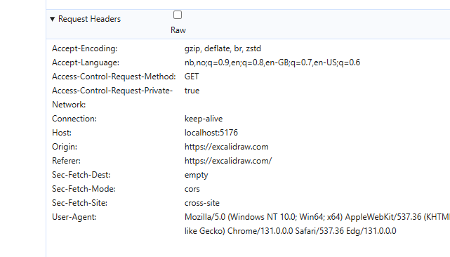

### CORS BILDE EKSEMPEL:

### LITT HJELPERESURSER FOR HTTPSTANDARDER

<a href="https://developer.mozilla.org/en-US/docs/Web/HTTP">Mozilla WebDocs HTTP standard<a/> 
Her finner man god informasjon om hva som er standard responsen til hver request. 
Her kan man også finne standarden til HTML, CSS og JAVASCRIPT.  

### SEKVENSDIAGRAMVERKTØY:

<a href="https://excalidraw.com">Excalidraw</a> 
Godt tegneverktøy, som vi bruker i timene for å sketche ut planene våre.  
<a href="https://app.diagrams.net/">Diagrams.net</a>
Mer standardisert diagramverktøy. Lar deg lagre backups i drive. 
<a href="https://mermaid.live/">Mermaid</a> 
Veldig godt, og mye brukt verktøy for å designe diagrammer. Bruker UML (Universal Modeling Language) 
For å generere gode diagrammer. Lar deg velge diagramtype via Sample Diagrams.
<a href="https://sequencediagram.org/">Sequence Diagram</a> 
Lar deg lage sekvensdiagrammer via UML.

